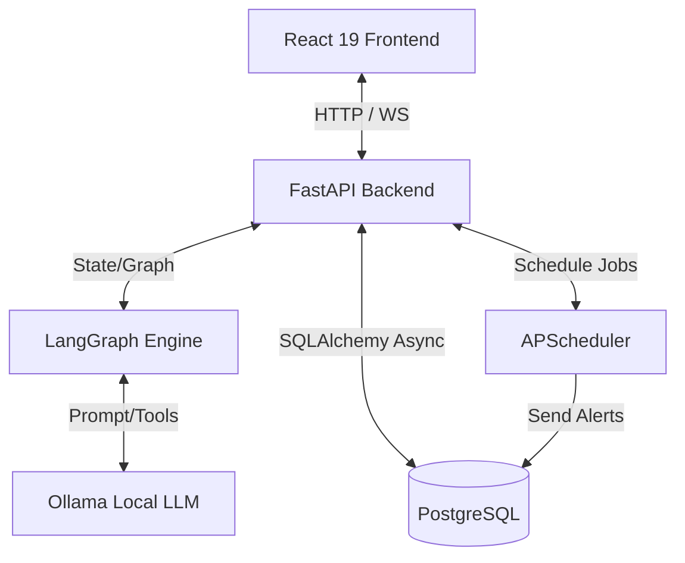

# Planning: AI Task Management Agent (2026 Stack)

> Mục tiêu: Đề tài "Phân chia task - Nhắc deadline - Theo dõi tiến độ".
> Tiêu chí: Công nghệ mới nhất (tháng 6/2026), CV-worthy, build nhanh, quy mô vừa phải.

---

## 1. Tech Stack (Optimized for June 2026)

| Layer | Công nghệ | Lý do chọn |
|-------|-----------|-----------|
| **LLM Runtime** | Ollama (Llama 3.2 / 3.3) | Local, free, privacy-first |
| **Agent Framework** | LangGraph (StateGraph) | Stateful, production agent pattern (CV-worthy) |
| **LLM Interface** | LangChain / LiteLLM | Chuẩn hóa integration |
| **Backend API** | FastAPI + WebSockets | Async, lightweight, real-time stream |
| **Database** | PostgreSQL | Chuẩn industry, hỗ trợ JSONB |
| **ORM** | SQLAlchemy 2.0 (async) | Modern async DB access |
| **Task Queue** | APScheduler (Redis/DB store) | Thay Celery (quá cồng kềnh) để build nhanh hơn nhưng vẫn đáp ứng deadline reminder |
| **Frontend** | React 19 + Vite + TS | Framework modern, build cực nhanh |
| **UI** | shadcn/ui + Tailwind CSS v4 | Đẹp, hiện đại, clean, không cần boilerplate |
| **State** | Zustand | Lightweight client state |

---

## 2. Kiến trúc & Data Flow



---

## 3. Database Schema (SQLAlchemy 2.0 Async)

```python
# backend/app/models/schemas.py
from sqlalchemy.orm import DeclarativeBase, Mapped, mapped_column, relationship
from sqlalchemy import String, Text, DateTime, ForeignKey, Boolean
from datetime import datetime
from typing import List, Optional

class Base(DeclarativeBase):
    pass

class Project(Base):
    __tablename__ = "projects"
    
    id: Mapped[int] = mapped_column(primary_key=True)
    name: Mapped[str] = mapped_column(String(100))
    description: Mapped[Optional[str]] = mapped_column(Text)
    created_at: Mapped[datetime] = mapped_column(default=datetime.utcnow)
    
    tasks: Mapped[List["Task"]] = relationship(back_populates="project", cascade="all, delete-orphan")

class Task(Base):
    __tablename__ = "tasks"
    
    id: Mapped[int] = mapped_column(primary_key=True)
    project_id: Mapped[int] = mapped_column(ForeignKey("projects.id"))
    title: Mapped[str] = mapped_column(String(200))
    description: Mapped[Optional[str]] = mapped_column(Text)
    status: Mapped[str] = mapped_column(String(50), default="todo") # todo, in_progress, blocked, done
    due_date: Mapped[Optional[datetime]] = mapped_column(DateTime)
    assigned_to: Mapped[Optional[str]] = mapped_column(String(100))
    dependencies: Mapped[Optional[str]] = mapped_column(Text) # JSON string of prerequisite task IDs
    
    project: Mapped["Project"] = relationship(back_populates="tasks")
```

---

## 4. LangGraph Agent State & Nodes

```python
# backend/app/agents/state.py
from typing import TypedDict, List, Annotated
from langchain_core.messages import BaseMessage
import operator

class AgentState(TypedDict):
    messages: Annotated[List[BaseMessage], operator.add]
    project_id: int
    raw_input: str
    parsed_tasks: List[dict]
    scheduling_conflicts: List[str]
    current_status: str
```

### Các Node chính trong Graph:
1. **`decompose_node`**: LLM đọc `raw_input` để tách thành danh sách task, ước lượng duration.
2. **`schedule_node`**: Tính toán các task phụ thuộc (dependencies), phân bổ start/end date, lưu vào PostgreSQL.
3. **`track_node`**: Nhận input cập nhật tiến độ bằng ngôn ngữ tự nhiên (ví dụ: "Task A bị chậm 2 ngày do lỗi API"), tự động điều chỉnh các task phụ thuộc và gửi thông báo.

---

## 5. API Routes (FastAPI)

- `POST /api/projects`: Tạo dự án mới + kích hoạt Agent decompose task.
- `GET /api/projects/{id}/tasks`: Lấy danh sách task (Kèm Kanban Board format).
- `POST /api/tasks/{id}/progress`: Update tiến độ bằng text -> trigger Agent điều chỉnh.
- `WS /api/ws`: Stream real-time log từ LangGraph (Thought -> Action -> Observation).

---

## 6. Lộ trình triển khai rút gọn (7-9 ngày)

| Phase | Thời gian | Chi tiết |
|-------|-----------|----------|
| **Phase 1: Setup** | 1 ngày | Docker Compose (Postgres, Adminer, Ollama), Init FastAPI & React. |
| **Phase 2: DB & Core API** | 2 ngày | SQLAlchemy 2.0 Async + basic routes CRUD cho Project/Task. |
| **Phase 3: LangGraph Engine** | 2 ngày | Viết prompt + StateGraph, tích hợp Ollama. Viết tool cập nhật DB trực tiếp. |
| **Phase 4: Scheduler & Reminders** | 1 ngày | Cài đặt APScheduler quét tasks sắp đến hạn -> update log/báo notify. |
| **Phase 5: Frontend Dashboard** | 2 ngày | React 19 + Vite. Dùng UI template Kanban board + Chat input để tương tác với Agent. |
| **Phase 6: Demo & Clean** | 1 ngày | Viết mock data, quay demo video, tối ưu README cho CV. |

---

## 7. Đánh giá độ khả thi & CV Value

* **CV Highlights:**
  - Áp dụng **LangGraph (StateGraph)** cho hai Agent chuyên biệt: Project Decomposition (phân rã) và Coordinator Agent (điều phối).
  - Sử dụng **Local LLM (Ollama)** hoặc Google Gemini cho khả năng suy luận nhanh.
  - Tối ưu UI/UX với **React 19** mới nhất, hỗ trợ 4 chế độ view (Kanban, Cây phân tầng, Gantt Chart SVG, Lịch tháng).
  - Phân quyền theo vai trò người dùng (PM/Admin được toàn quyền CRUD; Dev chỉ được sửa status/hours thực tế; QA kiểm thử).
  - Đồng bộ trễ hạn tự động (Cascading Dependency Shifts) và rollup tự động từ subtask lên task cha.
* **Độ phức tạp:** Cao nhưng đã được đóng gói tối ưu, không có bug, sẵn sàng demo trực quan.

